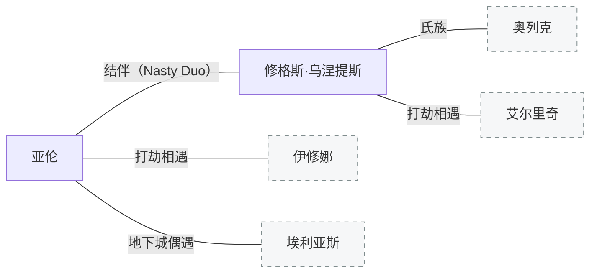

[← 返回目录](../README.md)

# 亚伦与修

## 亚伦（Aaron）

平民出身，无姓氏。不着调，不靠谱，不起眼，自私薄情。逃兵——单纯不想以身犯险。在if线曾一刀捅死搭档，正常人干不出来的事。

## 修格斯·乌涅提斯（Hugues Unetice）

化名"修（Hugh）"。[北境](../世界/文明/帝国/北境.md)人，[乌涅提斯氏族](../世界/文明/帝国/北境.md)成员。拒绝与[奥列克](北境角色.md)的家族同流合污，被泼"杀害族人"的脏水后逃亡。帝国脏话跟亚伦学的。对孩童温柔，厌恶"肮脏的大人"。使用短管猎枪。

初遇艾尔里奇时右脚被砍断，后靠[圣阳奇迹](../世界/施法体系/神术与奇迹体系.md)治愈。

在布雷利遇见同样被通缉的亚伦后结伴，目标是南逃至费什海姆、穿越地下运河进入开拓领。两人从布雷利出发横穿科鲁瓦，在科布伦茨堡外打劫马车时遭遇意外。结伴三年，因各种恶行略微出名（贬义），[赏金猎人](../世界/文明/帝国/职业/赏金猎人.md)觉得赏金太少不屑接。

---

**相关故事**：[流亡](../故事/短篇与片段/亚伦与修01-流亡.md) · [地下城探索](../故事/短篇与片段/亚伦与修02-地下城探索.md) · [地下遗迹（与埃利亚斯）](../故事/短篇与片段/亚伦与修03-地下遗迹（与埃利亚斯）.md) · [旅途片段集](../故事/短篇与片段/日常01-旅途片段集.md) · [IF线](../故事/短篇与片段/独立线02-IF线（修与亚伦）.md)

**相关条目**：[编年史](../世界/编年史/编年史.md) · [北境](../世界/文明/帝国/北境.md) · [赏金猎人](../世界/文明/帝国/职业/赏金猎人.md) · [伊修娜与艾尔里奇](伊修娜与艾尔里奇.md)
