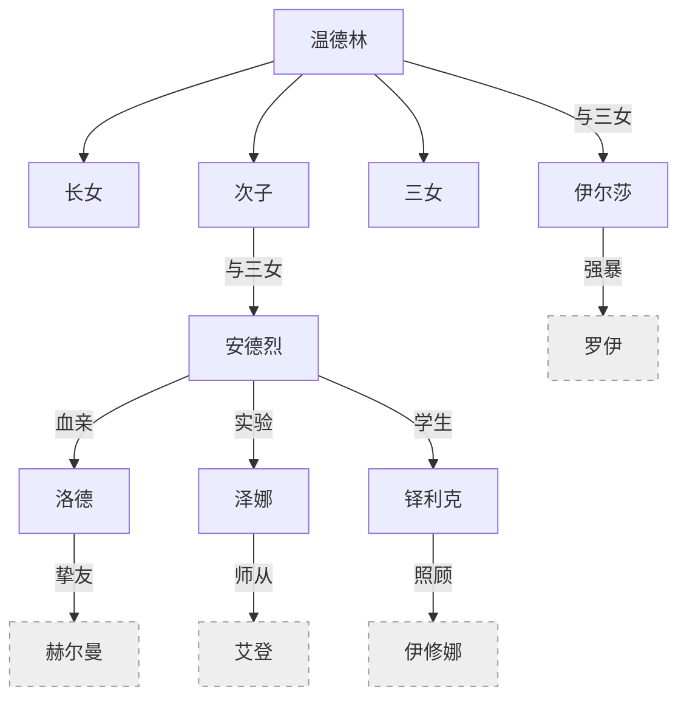
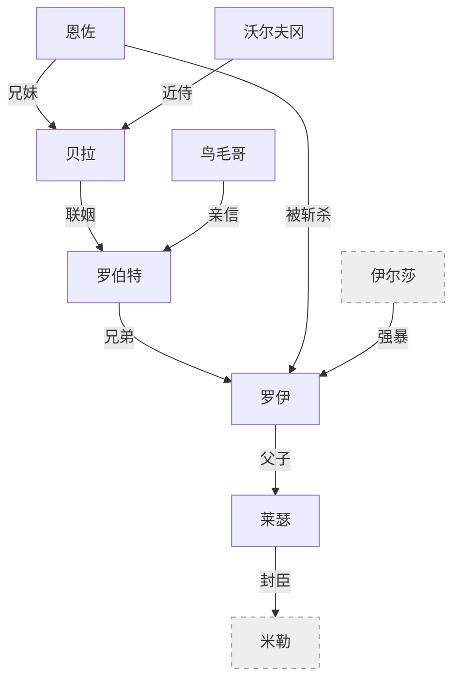
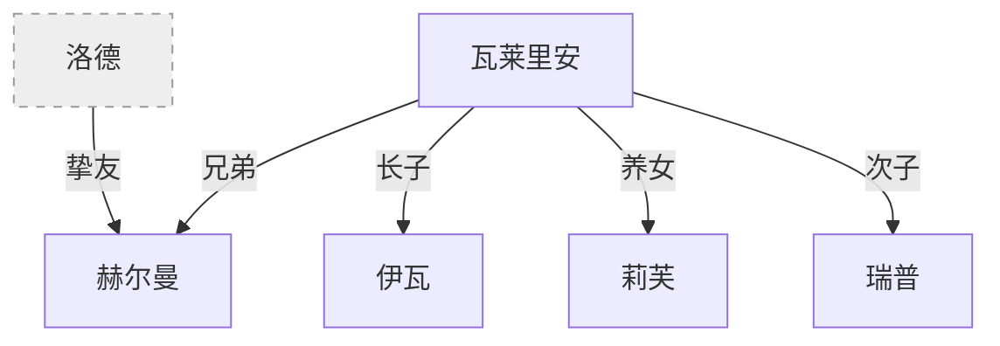
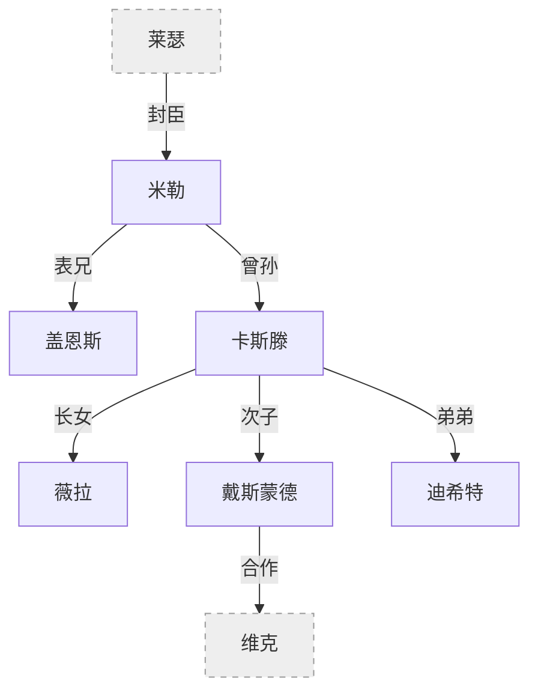
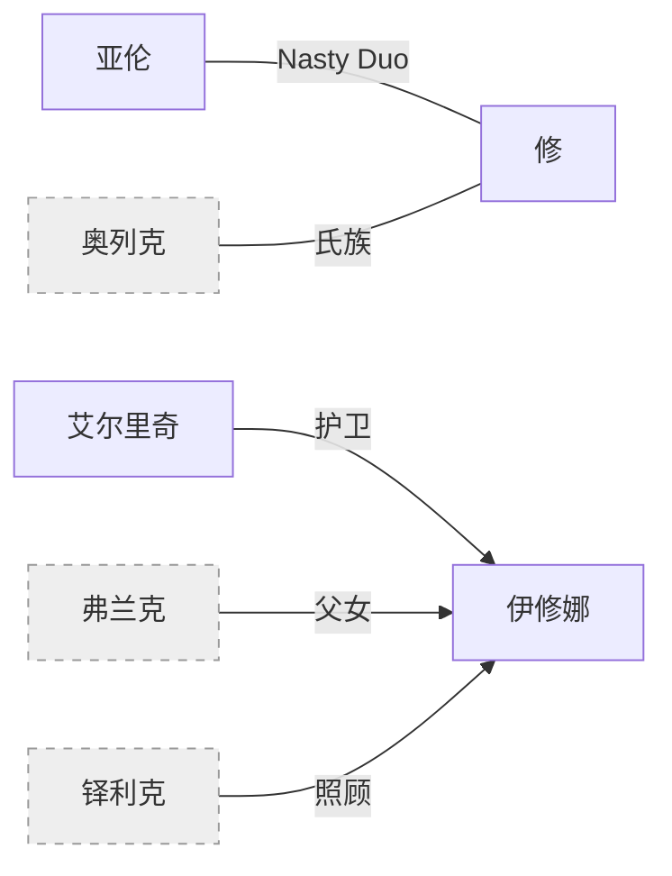
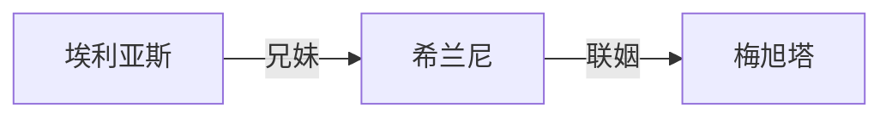
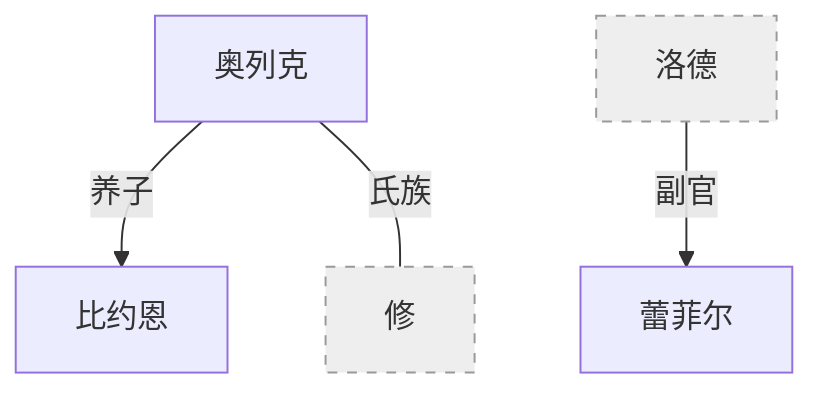
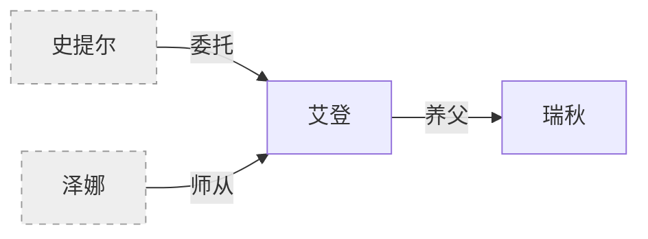

[← 返回目录](../README.md)

# 人物关系

---

### [欧恩斯坦家族](欧恩斯坦家族.md)

| 角色 | 席位 | 关系 |
| ------ | ------ | ------ |
| 温德林 | 初代皇帝 | 与人类生长女；与长女生次子、三女；与三女生伊尔莎 |
| 安德烈 | 第二席/总帅 | 提拔洛德、制造泽娜、培养铎利克 |
| 伊尔莎 | — | 温德林与三女之女。强暴罗伊，生下莱瑟 |
| 艾德琳 | 第三席 | 血宴总导演 |
| 洛德 | 第四席 | 挚友：赫尔曼。副官：蕾菲尔 |
| 维克 | 第五席 | 魔导义体开发 |
| 泽娜 | 第六席 | 龙血实验产物。朋友：萨菲恩缇娅 |
| 铎利克 | 继任候选 | 照顾伊修娜 |

---

### [维尔纳家族](维尔纳家族.md)

| 角色 | 身份 | 关系 |
| ------ | ------ | ------ |
| 罗伯特 | 厄里恩特领主 | 罗伊之兄，贝拉之夫 |
| 罗伊 | 罗伯特之弟 | 被伊尔莎强暴，生下莱瑟 |
| 莱瑟 | 科鲁维亚公爵 | 封臣：米勒 |
| 恩佐 | 德拉布雷家主 | 贝拉之兄，被罗伊斩杀 |
| 贝拉 | 恩佐之妹 | 嫁给罗伯特 |
| 沃尔夫冈 | 七指赏金猎人 | 贝拉近侍 |
| 鸟毛哥 | 罗伯特亲信 | 平民派领袖 |

---

### [奥利维亚家族](奥利维亚家族.md)

| 角色 | 身份 | 关系 |
| ------ | ------ | ------ |
| 赫尔曼 | 龙骑士 | 瓦莱里安之兄，洛德挚友 |
| 瓦莱里安 | 郡爵/银鹫会 | 赫尔曼之弟 |
| 伊瓦 | 长子 | 继承所有职位 |
| 莉芙 | 养女 | 伊瓦副手 |
| 瑞普 | 次子 | 自由骑士 |

---

### [格兰蒂斯家族](格兰蒂斯家族.md)

| 角色 | 身份 | 关系 |
| ------ | ------ | ------ |
| 米勒 | 科克兰郡爵 | 表兄：盖恩斯 |
| 卡斯滕 | 米勒曾孙 | 长女薇拉，次子戴斯蒙德，弟弟迪希特 |
| 戴斯蒙德 | 图书馆学者 | 与维克合作义体 |

---

### [亚伦与修](亚伦与修.md) · [伊修娜与艾尔里奇](伊修娜与艾尔里奇.md)

| 角色 | 身份 | 关系 |
| ------ | ------ | ------ |
| 亚伦 | 逃兵 | 与修结伴（Nasty Duo） |
| 修格斯 | 北境逃亡者 | 乌涅提斯氏族 |
| 伊修娜 | 圣阳旧派神选 | 护卫：艾尔里奇 |
| 艾尔里奇 | 武装修士 | 伊修娜护卫 |

---

### [贝洛与弗洛斯特](贝洛与弗洛斯特.md)

| 角色 | 身份 | 关系 |
| ------ | ------ | ------ |
| 埃利亚斯 | 贝洛家长子 | 妹妹：希兰尼 |
| 希兰尼 | 埃利亚斯之妹 | 联姻梅旭塔 |
| 梅旭塔 | 弗洛斯特领主 | 女扮男装继承 |

---

### [北境角色](北境角色.md)

| 角色 | 身份 | 关系 |
| ------ | ------ | ------ |
| 奥列克 | 北境大公 | 养子：比约恩 |
| 比约恩 | 奥列克养子 | 父母阵亡后过继 |
| 蕾菲尔 | 洛德副官 | 北地女战士 |

---

### [艾登与瑞秋](艾登与瑞秋.md)

| 角色 | 身份 | 关系 |
| ------ | ------ | ------ |
| 艾登 | 德鲁伊冒险者 | 养女：瑞秋 |
| 瑞秋 | 半精灵 | 被艾登收养十八年 |

---

### [图书馆与学院](图书馆与学院.md)

| 角色 | 身份 | 关系 |
| ------ | ------ | ------ |
| 萨菲恩缇娅 | 慧灵龙 | 泽娜的朋友 |
| 哈德罗斯/安德里亚斯 | 巫妖/学者 | 与真·精灵挚友 |
| 泰特·哈雷克 | 召唤系教师 | 召唤莱昂娜 |
| 赫芬·布林格 | 水元素系教师 | |
| 塞塔 | 侠义骑士 | 远征失去一臂 |
| 凯涅·罗兰妲 | 自由骑士 | |

---

### [其他角色](其他角色.md)

| 角色 | 身份 | 关系 |
| ------ | ------ | ------ |
| 弗兰克 | 伊修娜之父 | 托付铎利克 |
| 史提尔 | 守墓人/炼金术师 | 与艾登合作 |
| 扬·莱巴赫 | 阿奎莱亚总督 | 商业联合会主席 |
| 埃文·坎德拉 | 北教区主教 | |
| 瓦诺·莫图姆 | 无头骑士 | 被安德里亚斯复活 |
