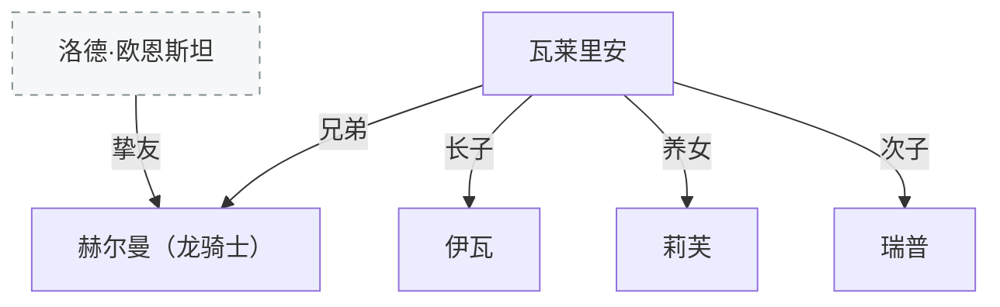

[← 返回目录](../README.md)

# 奥利维亚家族

第一次内乱期间自寒门骑士出身被提拔，受封阿戈隆德郡（帝都南方高地）。致力于训练骑士和军官，很少对政治表态。

## 赫尔曼·奥利维亚

瓦莱里安之兄。龙骑士，驻守开拓领，骑乘赤色飞龙。[洛德·欧恩斯坦](欧恩斯坦家族.md)的挚友——当年洛德怂恿他去偷飞龙的蛋，他真的付诸实践了。

## 瓦莱里安·奥利维亚

赫尔曼之弟。阿戈隆德郡爵、军务大臣（总帅的副手，负责军队管理调配）、银鹫会检察官兼代理会长（会长由核心成员轮换）、艾什伯格（帝都）郡尉（帝都三名郡尉之一，负责下城区治安）。效忠帝国本身而非皇帝，尊重并遵循帝国的律法和秩序，习惯光明正大解决问题。过于正直而树敌众多，本人地位崇高且武力优秀令人难以下手，但敌对者最终对他平民出身的妻子动手。瓦莱里安查明真相后盛怒率军攻击相关领主城池，将其绞死在阿戈隆德城门。尽管有大义名分，但跨越君权私下调动军队的行为近乎叛逆。皇帝体谅其丧妻之痛和忠心可鉴，仅革除军务大臣职务，令其回阿戈隆德。此后，他的银鹫会职位、郡尉职位、阿戈隆德郡爵头衔全部由长子伊瓦继承。

杀妻事件是[血宴](../世界/编年史/第二次帝国内战（血宴）.md)布局的一环：皇帝默许暗杀发生 → 瓦莱里安必然暴走 → 被合法剥夺军务大臣职位 → [安德烈](欧恩斯坦家族.md)失去最可靠的副手而被孤立。

## 伊瓦·奥利维亚

瓦莱里安长子，继承父亲所有职位。偏执、骄傲、因此也变得冷酷的骑士。蔑视弱者但也庇护弱者，认为力量与责任密不可分——无论贱民还是贵族，只要有人需要帮助就会伸出手，但绝非圣母。曾在袍泽犹豫如何处理人质情况时，毫不犹豫地将敌人连同人质一起斩杀——为了不让更多人牵连，人质的性命只是不得已支付的代价。强者没必要为弱者的失误负责。

对政治不擅长也不感兴趣，对宴会之类的场合更是如此。[血宴](../世界/编年史/第二次帝国内战（血宴）.md)当晚他在下城区巡逻——就算没有勤务也会找理由不来。

作为帝都郡尉在下城区巡逻时，经常遇到学院的年轻女生试图向他发出邀约，然后被他以妨碍公务严厉拨开到路边。

## 莉芙·奥利维亚

瓦莱里安养女，伊瓦副手。瓦莱里安原本想让她去学院学习魔法（颇有天赋），但她表示想做骑士并加入银鹫会。瓦莱里安告诉她非贵族进不了核心席位，但她说不奢望出人头地，尽力就好。暗恋伊瓦，默默支持。

## 瑞普·奥利维亚

瓦莱里安次子。作为次子没有继承压力，将来大概率在阿戈隆德得到一小块封地，成为闲散贵族——他本人觉得挺好的。性格温柔，甚至有些怯懦，和兄长形成鲜明反差。暗恋莉芙。

伊瓦在下城区巡逻时遇到的社交场面，通常由瑞普善后——一边赔笑一边给被推开的人道歉。

---

**相关故事**：[北境来客（洛德与赫尔曼）](../故事/短篇与片段/北境02-北境来客（洛德与赫尔曼）.md) · [奥利维亚家族线](../故事/故事线导读/奥利维亚家族线.md)

**相关条目**：[帝国四大家族与重要势力](../世界/文明/帝国/重要家族与势力.md) · [欧恩斯坦家族](欧恩斯坦家族.md) · [帝国](../世界/文明/帝国/政治与制度.md)
