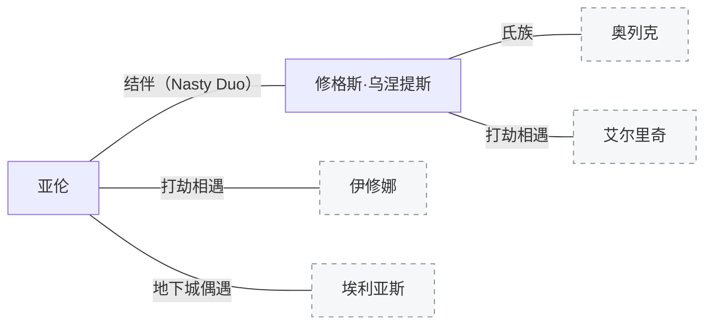

[← 返回目录](../README.md)

# 亚伦与修

## 亚伦（Aaron）

平民出身，无姓氏。不着调，不靠谱，不起眼，自私薄情。逃兵——单纯不想以身犯险。在if线曾一刀捅死搭档，正常人干不出来的事。

### 性格

亚伦希望掌握主动权，处于被动会让他感到不适。他的人生经历了漫长的漂泊，与曾经的友人也因为利益而割席，他最终认定只有自己是可靠的。

他的本性绝非一个邪恶之人，只是以自己的感受和利益为最高优先级，道德底线也并不高。他不会热衷于作恶，不会专门做些损人不利己的事；他如果伤害他人，那大概率是因为利益足够丰厚。

不着调、不起眼、看起来非常自由和随性，这些并不是他人格的底色，而是一种让自身变得世俗且圆滑的保护色，他也可以用这份不着调来掩盖自身真实的想法。他本人比看起来的更加细腻，或许也更加记仇，会对很多事耿耿于怀。

### 身世

他是一个孤儿，在街头成长，生活充斥着背叛、欺凌、暴力、谎言，这些塑造了他的不少行为习惯和流氓习气。之后就是四处找活干，积累了生活经验和技术，所以亚伦的处事经验，或者说社会化程度相当高。

### 名字的由来

"亚伦"不是真名。

他曾找上一支骑士小队，想谋个临时的差事，类似向导。自荐时连带提供了一些信息，算是见面礼，也借此展示自己的能力。他并不想入伙，真要打起来，他必然会脱离队伍躲起来，等战后再回来拾取遗物。结果他被金发骑士赶走，还挨了羞辱。他怀恨在心，一路尾随，等着捡漏。

小队遇袭，只有骑士凯利乌斯活了下来。凯利乌斯察觉有人靠近，喊了一个不存在的扈从名字"亚伦"来试探。他以为这是某个死去扈从的名字，便顺势应了下来，从此就叫亚伦。正文见短篇《亚伦之名》。

### 凯利乌斯

凯利乌斯已单独立档，见新结构 02-角色 下的《凯利乌斯》。

### 通缉

逃兵是一个比较笼统的叫法。亚伦作为雇佣兵受雇时监守自盗：其他人交战的时候，他带着东西跑路了。雇主大概率是本地的小贵族，而非阿奎莱亚那种更专业的职业承包人。

那个承包人因此赔了一大笔钱，但没办法单凭这个就悬赏亚伦。他毕竟是贵族，于是以逃兵为罪名向帝国汇报，将亚伦定罪通缉——尽管亚伦作为雇佣兵参与的战斗，和帝国官方没有任何关系。这桩通缉与洛德的战事无关。

## 修格斯·乌涅提斯（Hugues Unetice）

化名"修（Hugh）"。[北境](../世界/文明/帝国/北境.md)人，[乌涅提斯氏族](../世界/文明/帝国/北境.md)成员。拒绝与[奥列克](北境角色.md)的家族同流合污，被泼"杀害族人"的脏水后逃亡。帝国脏话跟亚伦学的。对孩童温柔，厌恶"肮脏的大人"。使用短管猎枪。

初遇艾尔里奇时右脚被砍断，后靠[圣阳奇迹](../世界/施法体系/神术与奇迹体系.md)治愈。

在布雷利遇见同样被通缉的亚伦后结伴，目标是南逃至费什海姆、穿越地下运河进入开拓领。两人从布雷利出发横穿科鲁瓦，在科布伦茨堡外打劫马车时遭遇意外。结伴三年，因各种恶行略微出名（贬义），[赏金猎人](../世界/文明/帝国/职业/赏金猎人.md)觉得赏金太少不屑接。

---

**相关故事**：[流亡](../故事/短篇与片段/亚伦与修01-流亡.md) · [地下城探索](../故事/短篇与片段/亚伦与修02-地下城探索.md) · [地下遗迹（与埃利亚斯）](../故事/短篇与片段/亚伦与修03-地下遗迹（与埃利亚斯）.md) · [旅途片段集](../故事/短篇与片段/日常01-旅途片段集.md) · [IF线](../故事/短篇与片段/独立线02-IF线（修与亚伦）.md)

**相关条目**：[编年史](../世界/编年史/编年史.md) · [北境](../世界/文明/帝国/北境.md) · [赏金猎人](../世界/文明/帝国/职业/赏金猎人.md) · [伊修娜与艾尔里奇](伊修娜与艾尔里奇.md)
