[← 返回目录](../README.md)

# 人物关系图

```mermaid
graph TD

%% ============ 帝国/龙裔 ============
subgraph dragon["帝国/龙裔（欧恩斯坦家族）"]
    n_wendelin["温德林·欧恩斯坦（初代/皇帝）"]
    n_eldest["长女（次代）"]
    n_third["三女（强次代）"]
    n_second_son["次子（强次代/皇帝?）"]
    n_ilsa["伊尔莎·欧恩斯坦（伪初代）"]
    n_andre["安德烈·欧恩斯坦（第二席）"]
    n_edeline["艾德琳·欧恩斯坦（第三席）"]
    n_vic["维克·欧恩斯坦（第五席）"]
end

%% ============ 安德烈的后继 ============
subgraph andre_line["安德烈提拔/制造"]
    n_lord["洛德·欧恩斯坦（第四席）"]
    n_zena["泽娜·欧恩斯坦（第六席）"]
    n_doric["铎利克·欧恩斯坦（学生）"]
end

%% ============ 北境 ============
subgraph north["北境"]
    n_olek["奥列克·乌涅提斯（大公）"]
    n_bjorn["比约恩"]
    n_reifil["蕾菲尔（副官）"]
end

%% ============ 主角团 ============
subgraph party["主角团"]
    n_hugues["修格斯·乌涅提斯"]
    n_aaron["亚伦"]
    n_ishuna["伊修娜"]
    n_elrich["艾尔里奇"]
    n_elias["埃利亚斯·贝洛"]
    n_steel["史提尔·阿列克斯"]
end

%% ============ 帝国/中央 ============
subgraph central["帝国/中央（奥利维亚家族）"]
    n_herman["赫尔曼·奥利维亚（龙骑士）"]
    n_valerian["瓦莱里安·奥利维亚"]
    n_iva["伊瓦·奥利维亚"]
    n_liv["莉芙·奥利维亚"]
    n_rip["瑞普·奥利维亚"]
end

%% ============ 图书馆/学院 ============
subgraph academy["图书馆/学院"]
    n_safi["萨菲恩缇娅（慧灵龙）"]
    n_desmond["戴斯蒙德·格兰蒂斯"]
    n_hadros["哈德罗斯/安德里亚斯"]
    n_tate["泰特·哈雷克"]
    n_herfen["赫芬·布林格"]
end

%% ============ 厄里恩特 ============
subgraph erient["厄里恩特/科鲁维亚"]
    n_robert["罗伯特·维尔纳"]
    n_roy["罗伊·维尔纳"]
    n_leiser["莱瑟·维尔纳"]
    n_enzo["恩佐·德拉布雷"]
    n_bella["贝拉·德拉布雷"]
    n_wolfgang["沃尔夫冈（七指）"]
    n_birdman["鸟毛哥"]
end

%% ============ 开拓领 ============
subgraph frontier["开拓领"]
    n_meshuta["梅旭塔·弗洛斯特"]
    n_hilani["希兰尼·贝洛"]
end

%% ============ 科克兰/格兰蒂斯 ============
subgraph cocklan["科克兰/格兰蒂斯家族"]
    n_miller["米勒·格兰蒂斯（郡爵）"]
    n_gains["盖恩斯·格兰蒂斯（表兄）"]
    n_karsten["卡斯滕·格兰蒂斯（曾孙）"]
    n_vera["薇拉·格兰蒂斯"]
    n_dihit["迪希特·格兰蒂斯"]
end

%% ============ 艾登线 ============
subgraph aidan_line["艾登线"]
    n_aidan["艾登·奥布莱恩（德鲁伊）"]
    n_rachel["瑞秋（半精灵）"]
end

%% ============ 弗兰克 ============
n_frank["弗兰克"]

%% ============ 龙裔血脉 ============
n_wendelin -->|"与人类"| n_eldest
n_wendelin -->|"与长女"| n_second_son
n_wendelin -->|"与长女"| n_third
n_wendelin -->|"与三女"| n_ilsa
n_second_son -->|"与三女"| n_andre

%% ============ 安德烈的关系 ============
n_andre -->|"血亲后裔"| n_lord
n_andre -->|"龙血实验"| n_zena
n_andre -->|"学生/继任者"| n_doric

%% ============ 伊尔莎 ============
n_ilsa -->|"强暴罗伊"| n_leiser

%% ============ 北境 ============
n_olek -->|"养子"| n_bjorn
n_olek --- n_hugues
n_lord -->|"副官"| n_reifil
n_lord -->|"挚友"| n_herman

%% ============ 奥利维亚家 ============
n_valerian -->|"兄弟"| n_herman
n_valerian -->|"长子"| n_iva
n_valerian -->|"养女"| n_liv
n_valerian -->|"次子"| n_rip

%% ============ 厄里恩特 ============
n_robert -->|"兄弟"| n_roy
n_roy -->|"父子"| n_leiser
n_enzo -->|"兄妹"| n_bella
n_bella -->|"联姻"| n_robert
n_wolfgang -->|"近侍/暧昧"| n_bella
n_birdman -->|"亲信"| n_robert
n_enzo -->|"被斩杀"| n_roy
n_leiser -->|"封臣"| n_miller
n_miller -->|"表兄"| n_gains
n_miller -->|"曾孙"| n_karsten
n_karsten -->|"长女"| n_vera
n_karsten -->|"弟弟"| n_dihit
n_karsten -->|"次子"| n_desmond

%% ============ 主角团关系 ============
n_elias -->|"兄妹"| n_hilani
n_hilani -->|"联姻"| n_meshuta
n_frank -->|"父女"| n_ishuna
n_frank -->|"托付"| n_doric
n_doric -->|"照顾"| n_ishuna
n_elrich -->|"护卫"| n_ishuna

%% ============ 学院 ============
n_safi -->|"朋友"| n_zena
n_desmond -->|"从泽娜得知情报"| n_zena
n_vic -->|"合作开发义体"| n_desmond

%% ============ 艾登线 ============
n_aidan -->|"养父"| n_rachel
n_steel -->|"指名委托"| n_aidan

%% ============ 样式 ============
style dragon fill:#e74c3c22,stroke:#e74c3c
style andre_line fill:#c0392b22,stroke:#c0392b
style north fill:#8e44ad22,stroke:#8e44ad
style party fill:#ecf0f122,stroke:#95a5a6
style central fill:#3498db22,stroke:#3498db
style academy fill:#1abc9c22,stroke:#1abc9c
style frontier fill:#2ecc7122,stroke:#2ecc71
style erient fill:#e67e2222,stroke:#e67e22
style cocklan fill:#f39c1222,stroke:#f39c12
style aidan_line fill:#27ae6022,stroke:#27ae60
```

## 图例

| 颜色 | 分组 | 说明 |
| ------ | ------ | ------ |
| 红色 | 帝国/龙裔 | 欧恩斯坦家族血脉与议会席位 |
| 深红 | 安德烈的后继 | 安德烈提拔/制造的龙裔 |
| 蓝色 | 帝国/中央 | 奥利维亚家族 |
| 紫色 | 北境 | 乌涅提斯氏族与白色守望 |
| 灰色 | 主角团 | 六人冒险者队伍 |
| 青色 | 图书馆/学院 | 学院与图书馆相关角色 |
| 橙色 | 厄里恩特 | 维尔纳家族与德拉布雷家 |
| 黄色 | 科克兰 | 格兰蒂斯家族 |
| 绿色 | 开拓领 | 弗洛斯特领与贝洛家 |
| 深绿 | 艾登线 | 德鲁伊冒险者线 |

连线标注为角色之间的具体关系（血缘、友谊、从属等）。无标注的连线表示关联关系。

---

## 文字版关系索引

### [欧恩斯坦家族](04-欧恩斯坦家族.md)（龙裔谱系）

| 角色 | 席位 | 与其他角色的关系 |
| ------ | ------ | ------ |
| 温德林 | 初代皇帝 | 与人类生长女；与长女生次子、三女；与三女生伊尔莎 |
| 次子 | （可能是后来的皇帝） | 与三女生安德烈 |
| 安德烈 | 第二席/总帅 | 提拔洛德（第四席）、制造泽娜（第六席）、培养铎利克（继任者） |
| 伊尔莎 | — | 温德林与三女之女。强暴罗伊·维尔纳，生下莱瑟 |
| 艾德琳 | 第三席/外交官 | 血宴总导演，皇帝的合伙人 |
| 洛德 | 第四席 | 安德烈血亲后裔。挚友：赫尔曼·奥利维亚。副官：蕾菲尔 |
| 维克 | 第五席/阴影 | 魔导义体开发者，与戴斯蒙德合作 |
| 泽娜 | 第六席 | 安德烈龙血实验产物。朋友：萨菲恩缇娅。血宴后走上德鲁伊之道（师从艾登） |
| 铎利克 | 继任候选 | 安德烈的学生。照顾伊修娜（弗兰克托付） |

### [维尔纳家族与厄里恩特](05-维尔纳家族与厄里恩特.md)

| 角色 | 身份 | 与其他角色的关系 |
| ------ | ------ | ------ |
| 罗伯特 | 厄里恩特领主 | 罗伊之兄，贝拉之夫。亲信：鸟毛哥。被恩佐间接害死 |
| 罗伊 | 罗伯特之弟 | 被伊尔莎击败后强暴，生下莱瑟。斩杀恩佐 |
| 莱瑟 | 科鲁维亚公爵 | 罗伊与伊尔莎之子（龙裔混血）。封臣：米勒 |
| 恩佐 | 德拉布雷家主 | 贝拉之兄。间接害死罗伯特后摄政，被罗伊斩杀 |
| 贝拉 | 恩佐之妹 | 嫁给罗伯特，联姻幸福。与沃尔夫冈有暧昧。死于大火 |
| 沃尔夫冈 | 七指赏金猎人 | 贝拉近侍骑士，杀恩佐眼线后断指流放，实为贝拉策划让其外出寻找莱瑟 |
| 鸟毛哥 | 罗伯特亲信 | 长期驻扎帕斯纳姆监护罗伊，平民派领袖 |

### [奥利维亚家族](07-奥利维亚家族.md)

| 角色 | 身份 | 与其他角色的关系 |
| ------ | ------ | ------ |
| 赫尔曼 | 龙骑士 | 瓦莱里安之兄。洛德的挚友。驻守开拓领 |
| 瓦莱里安 | 郡爵/银鹫会发起者 | 赫尔曼之弟。因妻子被害私调军队报复后被革职 |
| 伊瓦 | 瓦莱里安长子 | 继承父亲所有职位 |
| 莉芙 | 瓦莱里安养女 | 伊瓦副手 |
| 瑞普 | 瓦莱里安次子 | 自由骑士 |

### [格兰蒂斯家族](06-格兰蒂斯家族.md)

| 角色 | 身份 | 与其他角色的关系 |
| ------ | ------ | ------ |
| 米勒 | 科克兰伯爵 | 征服战争期间为莱瑟效力获封。表兄：盖恩斯 |
| 盖恩斯 | 米勒表兄/副手 | 沿岸港口领地 |
| 卡斯滕 | 米勒曾孙 | 帝国时代格兰蒂斯当家。弟弟：迪希特 |
| 薇拉 | 卡斯滕长女 | |
| 戴斯蒙德 | 卡斯滕次子 | 图书馆学者，假肢使用者。与维克合作开发义体 |
| 迪希特 | 卡斯滕之弟 | |

### 主角团 → [亚伦与修](02-亚伦与修.md) · [伊修娜与艾尔里奇](03-伊修娜与艾尔里奇.md)

| 角色 | 身份 | 与其他角色的关系 |
| ------ | ------ | ------ |
| 亚伦 | 逃兵 | 与修结伴三年（Nasty Duo） |
| 修格斯·乌涅提斯 | 北境逃亡者 | 与亚伦结伴。奥列克的氏族成员（背叛出走） |
| 伊修娜 | 圣阳旧派神选 | 父亲：弗兰克。铎利克照顾。护卫：艾尔里奇 |
| 艾尔里奇 | 武装修士 | 伊修娜的护卫，策反后一起出走 |
| 埃利亚斯·贝洛 | 贝洛家长子 | 妹妹：希兰尼。出走导致希兰尼被迫联姻 |
| 史提尔·阿列克斯 | 守墓人/炼金术师 | 与艾登合作处理女妖事件 |

### [北境角色](10-北境角色.md)

| 角色 | 身份 | 与其他角色的关系 |
| ------ | ------ | ------ |
| 奥列克·乌涅提斯 | 北境大公 | 养子：比约恩。操纵洛德失利后掌权 |
| 比约恩 | 奥列克养子 | 父母为奥列克战友，阵亡后过继 |
| 蕾菲尔 | 洛德副官 | 北地女性，橙红发 |

### 其他 → [其他角色](12-其他角色.md)

| 角色 | 身份 | 与其他角色的关系 |
| ------ | ------ | ------ |
| 艾登·奥布莱恩 | 德鲁伊冒险者 | 养女：瑞秋。退休后泽娜来投 |
| 瑞秋 | 半精灵 | 被艾登收养十八年 |
| 弗兰克 | 伊修娜之父 | 参与制造泽娜的实验，良心不安跑路。托付铎利克照顾伊修娜 |
| 希兰尼·贝洛 | 埃利亚斯之妹 | 联姻到弗洛斯特（与梅旭塔） |
| 梅旭塔·弗洛斯特 | 弗洛斯特领主 | 女扮男装继承爵位，与希兰尼联姻 |
| 萨菲恩缇娅 | 慧灵龙 | 泽娜的朋友，以人类形态活动于图书馆 |
| 哈德罗斯/安德里亚斯 | 巫妖/学者 | 与真·精灵是多年挚友。泰特、赫芬的同事 |
| 泰特·哈雷克 | 召唤系教师 | 意外召唤莱昂娜。父亲经营帝都酒馆 |
| 赫芬·布林格 | 水元素系教师 | 与哈德罗斯有过节 |
| 塞塔 | 侠义骑士 | 远征失去一臂，常泡在哈雷克酒馆 |
| 凯涅·罗兰妲 | 自由骑士/公务员 | 家族仅存的骑士头衔持有者 |

### 米勒心腹 → [格兰蒂斯家族](06-格兰蒂斯家族.md)

| 角色 | 身份 | 与其他角色的关系 |
| ------ | ------ | ------ |
| 卢卡什·埃森 | 厄尔诺流民 | 西部丘陵铁矿领地，武装精良 |
| 哈维 | 厄尔诺巡岸兵 | 西部林地领地 |
| 彼尔德 | 厄里恩特教士 | 北部科克大教堂，宗教事务代理 |
| 玻特 | 厄尔诺流民 | 东部林区领地，沉默寡言 |
| 阿克鲁格曼 | 魔法师顾问 | 赠予米勒抑制躁狂的戒指 |

### 七冠/帝国建立前

| 角色 | 身份 | 与其他角色的关系 |
| ------ | ------ | ------ |
| 哈罗德·克拉格米尔 | 阿戈隆德领袖 | 挚友：赫克温 |
| 赫克温·克拉格米尔 | 哈罗德的谋臣 | 草根出身，姓氏由哈罗德赋予 |
| 奥蕾莉亚·维里塔斯 | 维里塔利亚相关 | 分裂为科莱帕齐亚和科鲁维亚 |
| 西格德（负痕者） | 雷加利亚平民骑士 | 被德拉科尼斯挖角 |

### 圣阳教会 → [圣阳信仰](../04-信仰体系/01-圣阳信仰.md)

| 角色 | 身份 | 与其他角色的关系 |
| ------ | ------ | ------ |
| 埃文·坎德拉 | 科莱帕兹公爵/北教区主教 | 发起圣战号召 |
| 帕里·坎德拉 | 枢机主教 | 北境来客故事中委托洛德搜寻祝圣武器 |

### 蛮族

| 角色 | 身份 | 与其他角色的关系 |
| ------ | ------ | ------ |
| 托克 | 血牙部落老领袖 | 对新领袖的全面入侵计划持保留态度 |

### 卡利戈团（雾团）

| 角色 | 身份 | 与其他角色的关系 |
| ------ | ------ | ------ |
| 弗里兹 | 旧团长（半精灵骑士） | 养女：米娅。与科莱帕齐亚统治者私交甚密 |
| 米娅 | 新团长 | 弗里兹养女，继承冰魔法 |

### 赏金猎人/冒险者

| 角色 | 身份 | 与其他角色的关系 |
| ------ | ------ | ------ |
| 莱恩 | 赏金猎人（窃贼出身） | 搭档：博鲁特。魔力绝缘体 |
| 博鲁特 | 风元素法师 | 搭档：莱恩。翼装飞行 |
| 斯泰因 | 费什海姆出身战士 | 地下城探索中与亚伦同行。男同性恋 |
| 斯卡德·拉格纳松 | 北境猎人/向导 | 四人组成员，曾舍弃队友 |
| 拉维妮娅·科斯塔 | 南方帮派千金 | 四人组成员，买了格鲁·库噶 |
| 格蕾塔 | 老兵/雇佣兵 | 四人组成员，暗中保护拉维妮娅 |
| 格鲁·库噶 | 鱼人祭司 | 四人组成员，智力突变个体 |

### 其他（关系不明确） → [其他角色](12-其他角色.md)

| 角色 | 身份 | 备注 |
| ------ | ------ | ------ |
| 阿尔弗雷德 | 教会执行官 | 与邪魔签契约献祭半身 |
| 奥玛 | 执行官 | 一只鸟。没人知道为什么 |
| 埃德加 | 狼型亚人 | 血统不稳定，反感人类 |
| 莱昂娜 【联动】 | 云都改造人 | 被泰特召唤，为魔导义体提供灵感 |
| 兰贝特 | 学院剑术顾问（已故） | 尤斯塔斯的老师 |
| 尤斯塔斯 | 比武参赛者 | 替兰贝特出席 |
| 瓦诺·莫图姆 | 无头骑士（亡灵） | 被安德里亚斯复活，雷加利亚遗民 |
| 扬·莱巴赫 | 阿奎莱亚总督 | 商业联合会主席，萨莱诺海卫统帅 |
