[← 返回目录](../README.md)

# 人物关系图

```mermaid
graph TD

%% ============ 帝国/龙裔 ============
subgraph dragon["帝国/龙裔（欧恩斯坦家族）"]
    n_wendelin["温德林·欧恩斯坦（初代/皇帝）"]
    n_eldest["长女（次代）"]
    n_third["三女（强次代）"]
    n_second_son["次子（强次代/皇帝?）"]
    n_ilsa["伊尔莎·欧恩斯坦（伪初代）"]
    n_andre["安德烈·欧恩斯坦（第二席）"]
    n_edeline["艾德琳·欧恩斯坦（第三席）"]
    n_vic["维克·欧恩斯坦（第五席）"]
end

%% ============ 安德烈的后继 ============
subgraph andre_line["安德烈提拔/制造"]
    n_lord["洛德·欧恩斯坦（第四席）"]
    n_zena["泽娜·欧恩斯坦（第六席）"]
    n_doric["铎利克·欧恩斯坦（学生）"]
end

%% ============ 北境 ============
subgraph north["北境"]
    n_olek["奥列克·乌涅提斯（大公）"]
    n_bjorn["比约恩"]
    n_reifil["蕾菲尔（副官）"]
end

%% ============ 主角团 ============
subgraph party["主角团"]
    n_hugues["修格斯·乌涅提斯"]
    n_aaron["亚伦"]
    n_ishuna["伊修娜"]
    n_elrich["艾尔里奇"]
    n_elias["埃利亚斯·贝洛"]
    n_steel["史提尔·阿列克斯"]
end

%% ============ 帝国/中央 ============
subgraph central["帝国/中央（奥利维亚家族）"]
    n_herman["赫尔曼·奥利维亚（龙骑士）"]
    n_valerian["瓦莱里安·奥利维亚"]
    n_iva["伊瓦·奥利维亚"]
    n_liv["莉芙·奥利维亚"]
    n_rip["瑞普·奥利维亚"]
end

%% ============ 图书馆/学院 ============
subgraph academy["图书馆/学院"]
    n_safi["萨菲恩缇娅（慧灵龙）"]
    n_desmond["戴斯蒙德·格兰蒂斯"]
    n_hadros["哈德罗斯/安德里亚斯"]
    n_tate["泰特·哈雷克"]
    n_herfen["赫芬·布林格"]
end

%% ============ 厄里恩特 ============
subgraph erient["厄里恩特/科鲁维亚"]
    n_robert["罗伯特·维尔纳"]
    n_roy["罗伊·维尔纳"]
    n_leiser["莱瑟·维尔纳"]
    n_enzo["恩佐·德拉布雷"]
    n_bella["贝拉·德拉布雷"]
    n_wolfgang["沃尔夫冈（七指）"]
    n_birdman["鸟毛哥"]
end

%% ============ 开拓领 ============
subgraph frontier["开拓领"]
    n_meshuta["梅旭塔·弗洛斯特"]
    n_hilani["希兰尼·贝洛"]
end

%% ============ 科克兰 ============
subgraph cocklan["科克兰"]
    n_miller["米勒·格兰蒂斯"]
    n_gains["盖恩斯·格兰蒂斯"]
end

%% ============ 艾登线 ============
subgraph aidan_line["艾登线"]
    n_aidan["艾登·奥布莱恩（德鲁伊）"]
    n_rachel["瑞秋（半精灵）"]
end

%% ============ 弗兰克 ============
n_frank["弗兰克"]

%% ============ 龙裔血脉 ============
n_wendelin -->|"与人类"| n_eldest
n_wendelin -->|"与长女"| n_second_son
n_wendelin -->|"与长女"| n_third
n_wendelin -->|"与三女"| n_ilsa
n_second_son -->|"与三女"| n_andre

%% ============ 安德烈的关系 ============
n_andre -->|"血亲后裔"| n_lord
n_andre -->|"龙血实验"| n_zena
n_andre -->|"学生/继任者"| n_doric

%% ============ 伊尔莎 ============
n_ilsa -->|"强暴罗伊"| n_leiser

%% ============ 北境 ============
n_olek -->|"养子"| n_bjorn
n_olek --- n_hugues
n_lord -->|"副官"| n_reifil
n_lord -->|"挚友"| n_herman

%% ============ 奥利维亚家 ============
n_valerian -->|"兄弟"| n_herman
n_valerian -->|"长子"| n_iva
n_valerian -->|"养女"| n_liv
n_valerian -->|"次子"| n_rip

%% ============ 厄里恩特 ============
n_robert -->|"兄弟"| n_roy
n_roy -->|"父子"| n_leiser
n_enzo -->|"兄妹"| n_bella
n_bella -->|"联姻"| n_robert
n_wolfgang -->|"近侍/暧昧"| n_bella
n_birdman -->|"亲信"| n_robert
n_enzo -->|"被斩杀"| n_roy
n_leiser -->|"封臣"| n_miller

%% ============ 主角团关系 ============
n_elias -->|"兄妹"| n_hilani
n_hilani -->|"联姻"| n_meshuta
n_frank -->|"父女"| n_ishuna
n_frank -->|"托付"| n_doric
n_doric -->|"照顾"| n_ishuna
n_elrich -->|"护卫"| n_ishuna

%% ============ 学院 ============
n_safi -->|"朋友"| n_zena
n_desmond -->|"从泽娜得知情报"| n_zena
n_vic -->|"合作开发义体"| n_desmond

%% ============ 艾登线 ============
n_aidan -->|"养父"| n_rachel
n_steel -->|"指名委托"| n_aidan

%% ============ 样式 ============
style dragon fill:#e74c3c22,stroke:#e74c3c
style andre_line fill:#c0392b22,stroke:#c0392b
style north fill:#8e44ad22,stroke:#8e44ad
style party fill:#ecf0f122,stroke:#95a5a6
style central fill:#3498db22,stroke:#3498db
style academy fill:#1abc9c22,stroke:#1abc9c
style frontier fill:#2ecc7122,stroke:#2ecc71
style erient fill:#e67e2222,stroke:#e67e22
style cocklan fill:#f39c1222,stroke:#f39c12
style aidan_line fill:#27ae6022,stroke:#27ae60
```

## 图例

| 颜色 | 分组 | 说明 |
| ------ | ------ | ------ |
| 红色 | 帝国/龙裔 | 欧恩斯坦家族血脉与议会席位 |
| 深红 | 安德烈的后继 | 安德烈提拔/制造的龙裔 |
| 蓝色 | 帝国/中央 | 奥利维亚家族 |
| 紫色 | 北境 | 乌涅提斯氏族与白色守望 |
| 灰色 | 主角团 | 六人冒险者队伍 |
| 青色 | 图书馆/学院 | 学院与图书馆相关角色 |
| 橙色 | 厄里恩特 | 维尔纳家族与德拉布雷家 |
| 黄色 | 科克兰 | 格兰蒂斯家族 |
| 绿色 | 开拓领 | 弗洛斯特领与贝洛家 |
| 深绿 | 艾登线 | 德鲁伊冒险者线 |

连线标注为角色之间的具体关系（血缘、友谊、从属等）。无标注的连线表示关联关系。
