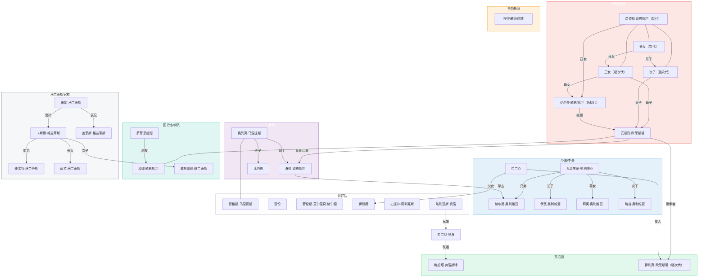

[← 返回目录](../README.md)

# 人物关系图

## 图例

| 颜色 | 分组 | 说明 |
|------|------|------|
| 红色边框 | 帝国/龙裔 | 欧恩斯坦家族龙裔血脉成员 |
| 蓝色边框 | 帝国/中央 | 帝国中央势力，含奥利维亚家族 |
| 紫色边框 | 北境 | 北境势力，含乌涅提斯氏族 |
| 灰色边框 | 拼好队 | 主角冒险者队伍 |
| 青色边框 | 图书馆/学院 | 学院与图书馆相关角色 |
| 橙色边框 | 圣阳教派 | 圣阳信仰相关角色 |
| 绿色边框 | 开拓领 | 开拓领驻扎角色 |
| 浅灰边框 | 格兰蒂斯家族 | 格兰蒂斯家族成员（无特定势力归属） |

连线标注为角色之间的具体关系（血缘、友谊、从属等）。无标注的连线表示直系血缘或从属关系。
