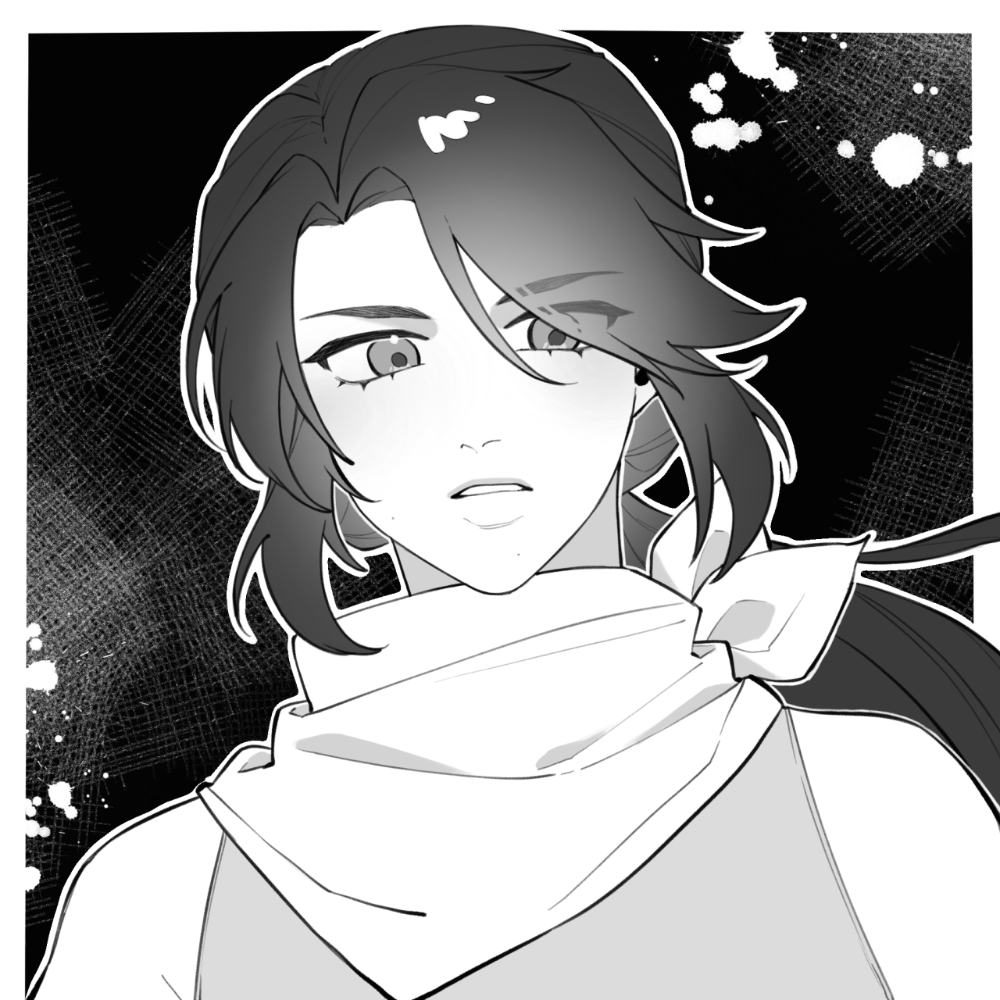

[← 返回目录](../README.md)

# 学院与帝都角色

## 安德里亚斯/哈德罗斯

见[巫妖灾害](../05-历史与时间线/07-巫妖灾害与北境独立.md)章节。第二人格哈德罗斯在帝都以学者身份生活。体温冰冷，对冷热都不敏感。热衷各种知识，乐于尝试，但自己进行[召唤](../02-魔法体系/02-奥术体系.md)总是不成功——泰特认为是相性问题，觉得[死灵系](../02-魔法体系/02-奥术体系.md)可能更适合他，但哈德罗斯本人觉得死灵系过于亵渎死者。偶尔会来泰特的课室观察召唤仪式，也应邀去过哈雷克酒馆——觉得那里暖烘烘的很舒服。

## 泰特·哈雷克

召唤系最后的教师，近十年没收学生。异界生物百科作者。至少十年来重复着同样的生活，大部分时间在课室研究召唤系，剩余时间只在学院塔楼顶和自家酒馆活动。工作原因不沾酒。

父亲老哈雷克嗜酒，经营着帝都核心区的酒馆（从泰特祖父辈开始，几十年老店）。老哈雷克喝醉后就需要泰特来看场。酒馆因靠近核心区，客群主要是骑士团成员和军官，很多人退役后也会特地回来。学院大部分人不屑光顾，但哈德罗斯和赫芬应邀来过。[弗兰克](09-其他角色.md)在帝都时也常来喝酒，偶尔会和[铎利克](03-欧恩斯坦家族.md)一起来。哈雷克家其实不缺钱——在君王林附近有酒庄，城内也有住宅，继续经营大概是等儿子成长到能安心继承的时候，也因为自己喜欢这种氛围。

## 赫芬·布林格

[元素系](../02-魔法体系/02-奥术体系.md)水系教师，已婚。和哈德罗斯似乎有过节，两人很少同时出现。应邀去酒馆时只会点杯蜜酒坐在吧台一角默默喝完。

## 塞塔

侠义骑士，远征失去一臂，魔法水平很高。远征结束后第一件事就是回哈雷克酒馆痛饮，庆祝自己的生还。

## 凯涅·罗兰妲

新人自由骑士，市政厅公务员。维持家族最后存在感。

---

**相关条目**：[帝国](../06-国家与势力/01-帝国.md) · [巫妖灾害与北境独立](../05-历史与时间线/07-巫妖灾害与北境独立.md) · [奥术体系](../02-魔法体系/02-奥术体系.md) · [其他角色（莱昂娜）](09-其他角色.md)
