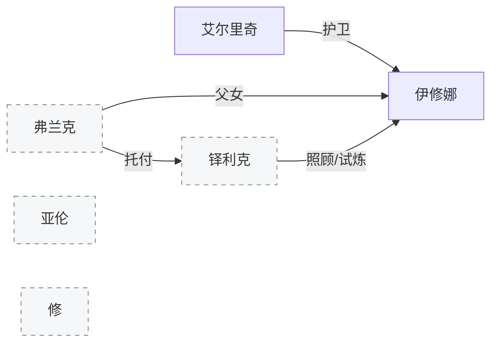

[← 返回目录](../README.md)

# 伊修娜与艾尔里奇

## 伊修娜（Ishona）

17岁（故事开始时），父亲[弗兰克](其他角色.md)（参与制造[泽娜](欧恩斯坦家族.md)的人体实验，后良心不安跑路自首被处决）独自抚养长大。住在深山老林，对外界知之甚少但渴望探索。

[圣阳信仰](../世界/信仰/圣阳信仰.md)旧派的天然契合者。旧派崇尚光明与纯粹——与"公正"这种后天产生的概念不同，人对光明的向往几乎是本能。伊修娜住在深山老林、对外界知之甚少，内心保有朴实的良善，恰恰天然地符合旧派修士的条件。旧派想用她来证明自身的优越性："连这样的少女都能满足我们教派的宗旨，这才是人们潜意识里渴望的东西。"但伊修娜本人对这种争辩毫无兴趣。

能力：非主动施展奇迹，而是行为被认可后被动获得赐福。疗愈（太阳→普照万物→滋养生命）。

武器：神圣之铳"[埃涅阿斯](../世界/文明/帝国/科技/火药武器.md)"（父亲的成人礼物），将信仰力量转化为光束子弹。

在教会任职一段时间后策反了监视她的艾尔里奇，两人跑路。

## 艾尔里奇（Elrich）

全名：劳伦斯·艾尔里奇·赫尔德（Laurence Elrich Held）。宗教世家出身的武装修士——武装修士地位高于常规修士，肩负更多责任，成员会舍弃与世俗家族的联系，互以教名相称以示融入集体。"劳伦斯"是正式成为武装修士时被赋予的教名，赫尔德是家族姓氏。

对骑士的认知来源于父亲——同样是归属教会、负责保护神选之人的骑士。父亲给他的印象是强大、可靠、坚韧、忠诚、寡言。他想成为的不是骑士这个身份，而是"和父亲一样的人"。出于这份憧憬接受了使命，但很早就对教会本身表现出叛逆——如果神选能代表神的意志，那试图掌握这种力量的教会岂非大逆不道？只是忠诚是骑士的美德，他不愿因此破坏自己坚持的形象。

直到遇到伊修娜——毫无信仰可言的神选。厌恶家族安排的一成不变的人生。舍弃了教名和姓氏，从此信仰和血统都不再是桎梏——他就只是艾尔里奇。跟伊修娜一起出走。

战斗：双剑流（不同尺寸），能瞬发奇迹（金色壁垒），掌握"三重影·改"（魔力制造剑击虚影，三道中一道真实）。

---

**相关条目**：[编年史](../世界/编年史/编年史.md) · [圣阳信仰](../世界/信仰/圣阳信仰.md) · [欧恩斯坦家族](欧恩斯坦家族.md) · [亚伦与修](亚伦与修.md)
