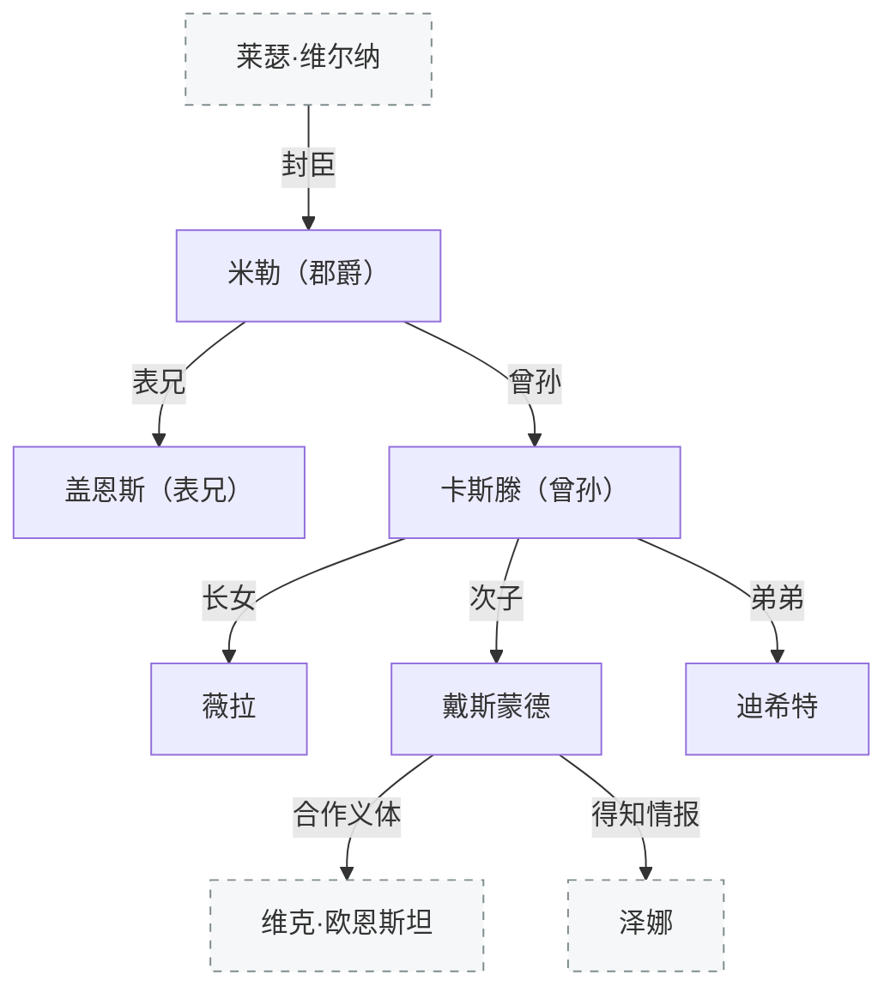

[← 返回目录](../README.md)

# 格兰蒂斯家族



## 米勒

科克兰郡爵（帝国直封）。原厄尔诺磨坊主，家乡因抵制科鲁瓦统治被屠杀。带难民组建佣兵团（伯劳连队），[征服战争](../世界/编年史/征服战争与帝国建立.md)期间为[莱瑟](维尔纳家族.md)效力，表现出色获封。患躁狂症（靠魔法戒指抑制）。

法理上直接对皇帝负责，属地上上级是科莱帕兹公爵[埃文·坎德拉](其他角色.md)，但实际接触最多的是征服战争时期的雇主——科鲁维亚公爵莱瑟。

## 心腹

- **盖恩斯·格兰蒂斯**：表兄，最信赖的副手，文化水平不高但办事尽心，战时冒充便宜军师。领地为包含港口在内的沿岸地区
- **卢卡什·埃森**（Eisen=铁）：厄尔诺流民，佣兵团早期成员。领地在科克兰西部丘陵，因铁矿开发而收入可观，麾下士兵武装精良仅次于米勒亲卫。姓氏纪念封地发现铁矿
- **哈维**：厄尔诺巡岸士兵，佣兵团早期成员。领地在西部卢卡什和腹地米勒之间，多林地
- **彼尔德**：厄里恩特教士，战争期间加入佣兵团，视不信圣阳者为异教徒。领地在北部，以科克大教堂为中心，与当地教长关系甚密，代米勒处理宗教事务
- **玻特**：厄尔诺流民，沉默寡言。领地在东部林区
- **阿克鲁格曼**：米勒年轻时偶遇的魔法师，当时米勒对其伸出援手，作为回报获赠一枚抑制情绪的戒指（米勒患躁狂症，佩戴后不再发作）。十年后米勒以伯爵身份将其邀为宫廷法师兼魔法顾问

## 格兰蒂斯家族后人

米勒和盖恩斯的后代，活跃在第二次内战前后。

```text
米勒·格兰蒂斯（征服战争时期）
└── ……
    └── 卡斯滕·格兰蒂斯（米勒曾孙）
        ├── 薇拉·格兰蒂斯（长女）
        └── 戴斯蒙德·格兰蒂斯（次子）
    迪希特·格兰蒂斯（卡斯滕之弟）
```

### 卡斯滕·格兰蒂斯

米勒的曾孙，格兰蒂斯家族在帝国时代的当家。

### 迪希特·格兰蒂斯

卡斯滕之弟。

### 薇拉·格兰蒂斯

卡斯滕长女。

### 戴斯蒙德·格兰蒂斯

卡斯滕次子。假肢使用者，[帝国](../世界/文明/帝国/政治与制度.md)大图书馆学者。参与[魔导设备](../世界/文明/帝国/科技/魔导义体.md)研究。从[泽娜](欧恩斯坦家族.md)口中得知[艾德琳](欧恩斯坦家族.md)分裂帝国计划。

---

**相关条目**：[维尔纳家族与厄里恩特](维尔纳家族.md) · [征服战争与帝国建立](../世界/编年史/征服战争与帝国建立.md) · [魔导义体](../世界/文明/帝国/科技/魔导义体.md) · [帝国](../世界/文明/帝国/政治与制度.md) · [图书馆与学院](图书馆与学院.md)
