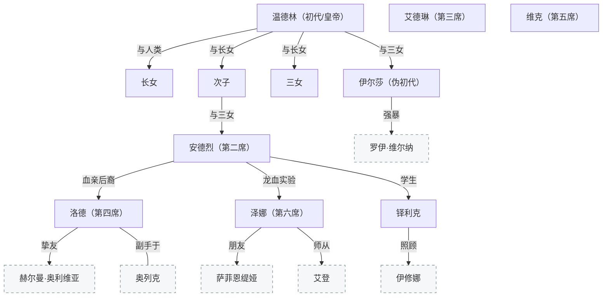
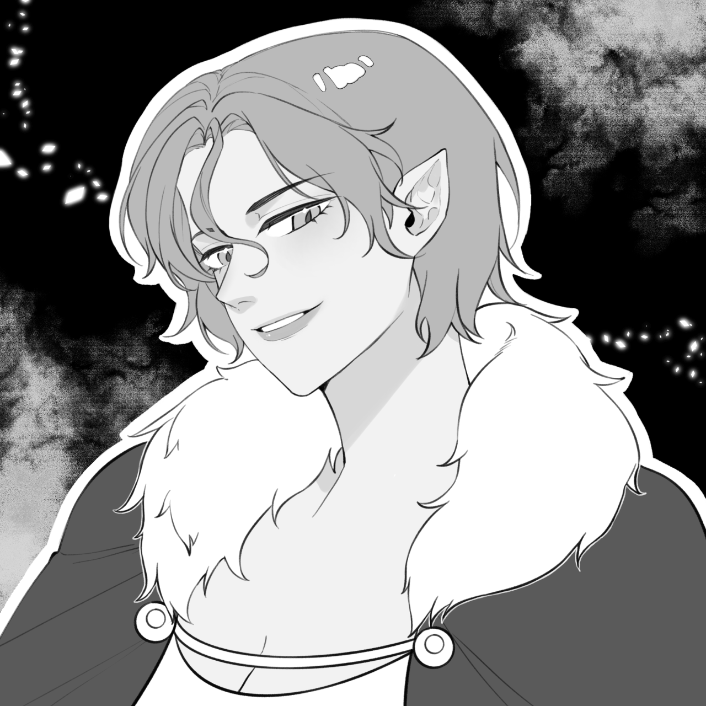
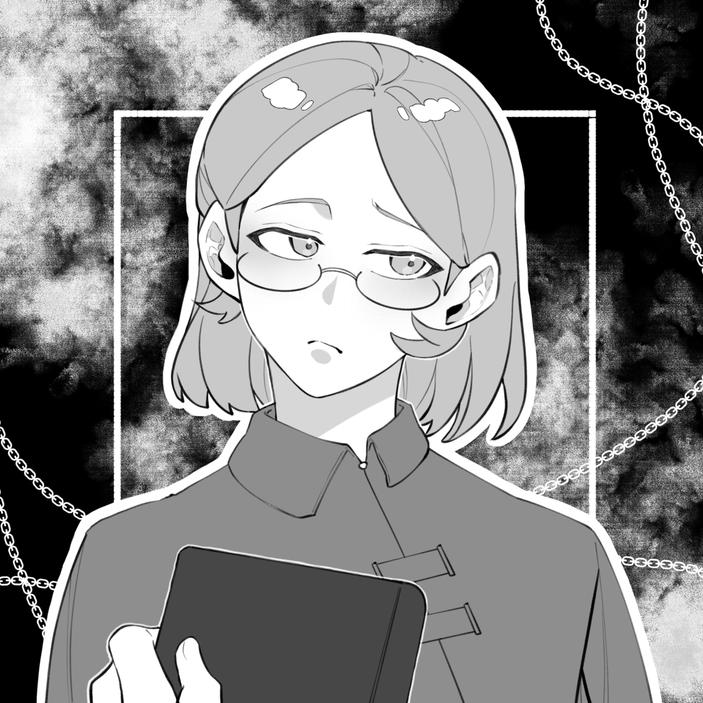
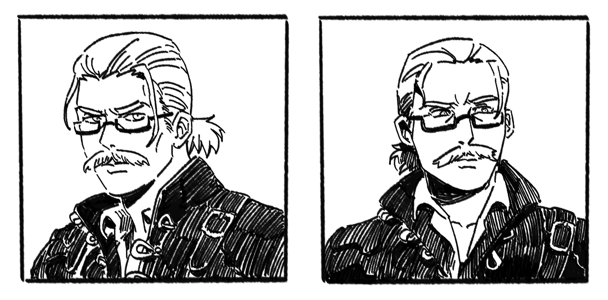
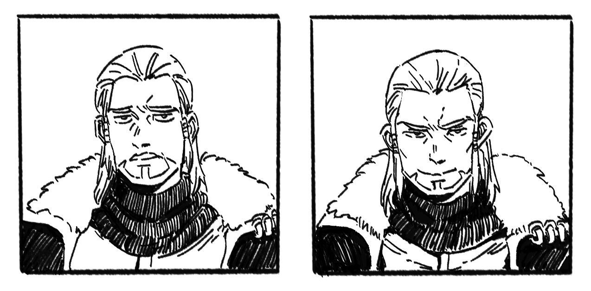

[← 返回目录](../README.md)

# 欧恩斯坦家族



## 家族谱系

```text
温德林·欧恩斯坦（初代）
│
├──（与人类）──→ 长女（次代）
│
├──（与长女）──→ 次子（强次代，可能是后来的皇帝）
│               └──（与三女）──→ 安德烈·欧恩斯坦
│
├──（与长女）──→ 三女（强次代）
│               └──（与次子）──→ 安德烈·欧恩斯坦
│
└──（与三女）──→ 伊尔莎·欧恩斯坦（伪初代，对外以温德林四女身份示人）
                  └──（强暴罗伊·维尔纳）──→ 莱瑟·维尔纳

安德烈
├──→ 泽娜（龙血实验制造）
├──→ 铎利克（学生/继承者）
└──→ 洛德（血亲后裔）
```

> 注："初代/次代/强次代/伪初代"指龙裔血统的代际强度。温德林与人类生下长女（次代）；温德林与长女生下次子和三女（强次代，近亲使血统浓度回升）；次子与三女生下安德烈；温德林与三女（自己的孙女）生下伊尔莎——伊尔莎对外以温德林四女身份示人，称"伪初代"，实际是温德林的女儿兼曾孙女。次子可能就是后来的皇帝。

## 温德林·欧恩斯坦

[帝国](../世界/文明/帝国/政治与制度.md)缔造者，[七冠](../世界/编年史/七冠时代.md)末期德拉科尼斯领袖。红发金瞳。初代[龙裔](../世界/种族/龙裔起源.md)，龙血纯度100%——最强大、最可怕、最不似人。

温德林是一个只在乎自己的人，对他人通常漠不关心。他发现了先祖封存的[贝希摩斯](../世界/生物/龙类分类.md)之血，经过数十年研究后认定这是完成终极目标的关键——他想摆脱孱弱的人类身躯，成为**巨龙**。

为争取时间，他设计了[重生仪式](../世界/种族/龙裔起源.md#重生仪式)：以"集体承担龙血"为由召集德拉科尼斯各猎龙家族的精英，实则事先以微量龙血长期适应身体，在仪式中率先苏醒后杀死所有非欧恩斯坦血脉的幸存者。龙裔血脉从此专属欧恩斯坦家族，德拉科尼斯再无能与之分庭抗礼的势力。

成为龙裔只是第一步——为化龙研究换取超长寿命。数年后他意识到仅靠德拉科尼斯的资源不足以支撑计划，由此产生了统一西方的动力，发起[征服战争](../世界/编年史/征服战争与帝国建立.md)建立帝国。但他对帝国本身毫无兴趣，将一切能调度的资源投入化龙研究，对政务根本无心过问。

[第一次内乱](../世界/编年史/征服战争与帝国建立.md#第一次内乱)期间，温德林在决战的战场上完成了化龙——俯身亲吻大地，以战场上所有人的血肉、灵魂和恐惧为养料，蜕变为四足双翼的巨龙。在他化龙的那一刻，连龙裔都成为了他的敌人。各派系联手，不惜一切代价最终将巨龙杀死。

首位飞升的龙裔就此陨落。但他已经没有遗憾——他得偿所愿。

龙裔状态下，龙的力量与人类躯体不匹配，导致欲望失控和认知膨胀。但化龙后，肉体、力量、智慧三者终于相匹配，温德林反而从龙裔的狭隘中**解脱**了——从"我必须绝对掌控"，到"一切已经完美"的满足与放松。

## 安德烈·欧恩斯坦

议会第二席/总帅。三女与次子之子（温德林曾孙辈）。放弃继位扶持他人，以总帅身份守护帝国两百余年。战友亲人百年前全部死去。[血宴](../世界/编年史/第二次帝国内战（血宴）.md)中被杀。

## 伊尔莎·欧恩斯坦

温德林与三女所生（温德林既是她的父亲也是她的曾祖父）。对外以温德林四女身份示人（伪初代）。名字意为"神（龙）的誓言"——并非俯首于神明，而是顺从血脉中流淌的本能。

对政治漠不关心，热衷战斗，到处挑战强者并在打赢后强暴对方、诞下子嗣，生下的孩子很多但并不在意这些后代。培养安德烈成为战士的人，安德烈漫长人生中唯一畏惧过的存在。最终死于自己并不认识的某位子代之手。

强暴[罗伊·维尔纳](维尔纳家族.md)后生下莱瑟。

## 艾德琳·欧恩斯坦



议会第三席，外交官。龙裔×[精灵](../世界/种族/种族总览.md)混血【旧设定】，血统劣于同辈，头发是罕见的绿色。智商极高，比起暴力更依赖谋划，也因此成为皇帝天然的合伙人。大姐头般的人物，虽然真心喜爱着弟弟妹妹们，但将弱肉强食作为信条贯彻，思维可能比其他龙裔更接近龙。驻格莱德尼亚的外交官，负责帝国与精灵间的事宜。[血宴](../世界/编年史/第二次帝国内战（血宴）.md)的总导演。

## 维克·欧恩斯坦

议会第五席，帝国的阴影。从不露面。安德烈的同辈旁系龙裔。

曾经是强大的战士，深知如何通过魔力干涉自己的肉体。转而投身于[魔导义体](../世界/文明/帝国/科技/魔导义体.md)的开发——从第一代的拟似神经控制，到与[戴斯蒙德](格兰蒂斯家族.md)合作的储能改进，再到借助[莱昂娜](其他角色.md)【联动】的科技知识实现原理性重构。开发成功后给自己装了四只手。

[血宴](../世界/编年史/第二次帝国内战（血宴）.md)中作为秘密合伙人参与——乐见安德烈陨落，换取皇室对魔导装备项目的全力支持。

## 泽娜·欧恩斯坦



议会第六席，帝国大图书馆管理员。安德烈用龙血制造的生物兵器实验唯一幸存者。孤儿出身，被图书馆收留，无学术产出，某种意义上是藏品之一。外表年轻实际四十好几。

人生简单到只有三段经历——孤儿、实验体、图书馆管理员。唯一称得上血脉相连的是给予她龙血的安德烈，而她在[血宴](../世界/编年史/第二次帝国内战（血宴）.md)中亲手斩断了这段关系。

龙血实验赋予了她龙人化的超然力量，但她并不引以为傲——这只让她愈发感觉自己是人群中的异类。龙人化时容易暴走，难以精确控制。

血宴后离开德拉科尼斯，开始流浪。最终来到[格莱德尼亚森林](../世界/信仰/自然信仰与德鲁伊.md)，找到退休中正在陪老师的[艾登](艾登与瑞秋.md)，走上[德鲁伊](../世界/信仰/自然信仰与德鲁伊.md)之道。

德鲁伊追求万物共谐，其化形奇迹的本质是发自内心地平等看待万物——人、兽、鸟、虫都只是自然生灵的不同形态。对泽娜而言，便是将龙也一视同仁，将体内的暴戾视为自己的一部分，改变认知，以[唯心](../世界/施法体系/神术与奇迹体系.md)的力量实现更平衡、稳定的龙化控制，而非动辄暴走。

这份和解也包括承担自己犯下的错——她杀死了安德烈、掀起了内乱的序幕，也应当努力为其画下休止符。

## 铎利克·欧恩斯坦



安德烈的学生，被视为第二席继任者但拒绝。游历各地学习武技（蛮族牙取式、精灵魔力强化视觉等），偏好徒手，弃剑多年。

离开帝都前往莫洛恩担任[冒险者](../世界/文明/帝国/职业/冒险者.md)公会会长。照顾[伊修娜](伊修娜与艾尔里奇.md)（[弗兰克](其他角色.md)的托付）和艾尔里奇。

听到帝国内部出事风声后对二人进行试炼施压。

## 洛德·欧恩斯坦



议会第四席。安德烈提拔的军派龙裔——安德烈作为总帅是帝国军事事务的最高领袖，洛德是他一手培养的继任方向。

按照传统，龙裔会被派遣到边境驻守历练。安德烈将洛德派往[北境](../世界/文明/帝国/北境.md)，用意是让他在历练的同时多和北地人交往——北境非七冠盟誓成员，是帝国二次扩张才并入的领地，人种有差异，与中央疏远。安德烈希望洛德去监督并拉拢他们。

但洛德被[奥列克](北境角色.md)算计了。格莱德尼亚遗民和北方蛮族（北境之外）在奥列克撮合下围攻北境多处据点，洛德连续战事失利被当地人驱逐，帝国戍边军团几乎遣散。奥列克乘机上演救场逆转，顺势成为北境实际控制者。重新整编军团后把洛德找回来，继续让他担任军团领袖——洛德有用但不能有权。

[第二次内战](../世界/编年史/第二次帝国内战（血宴）.md)中被定义为叛党核心。

与[赫尔曼·奥利维亚](奥利维亚家族.md)是挚友。

副官：[蕾菲尔](北境角色.md)——橙红发丝随意扎成辫子，白皙脸庞冻得发红，有雀斑，眼神凶狠。北地女战士，实力值得信赖，和洛德关系亲近（会直接扯他领子）。

---

**相关条目**：[龙裔起源](../世界/种族/龙裔起源.md) · [第二次内战（血宴）](../世界/编年史/第二次帝国内战（血宴）.md) · [征服战争与帝国建立](../世界/编年史/征服战争与帝国建立.md) · [帝国](../世界/文明/帝国/政治与制度.md) · [维尔纳家族](维尔纳家族.md)
