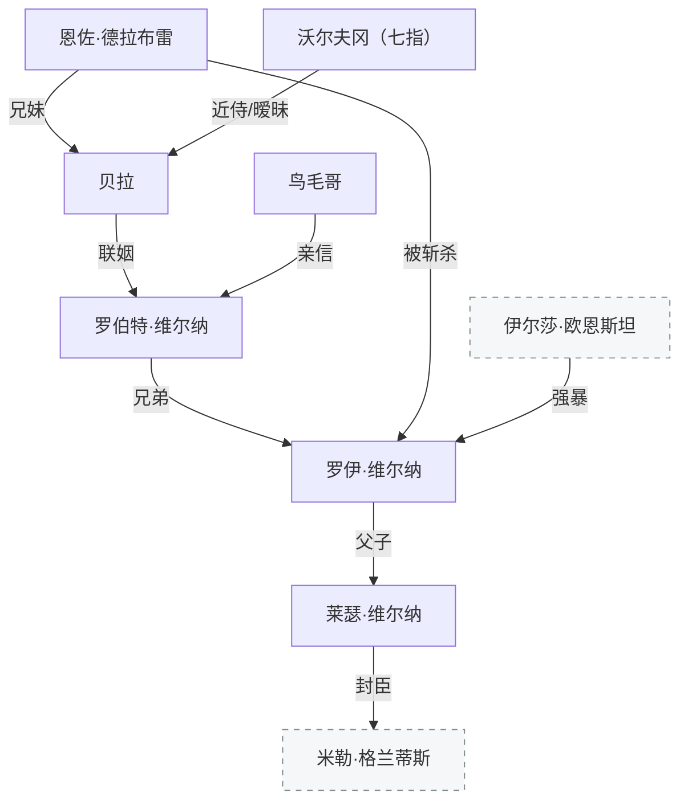

[← 返回目录](../README.md)

# 维尔纳家族与厄里恩特

## 罗伯特·维尔纳

厄里恩特领主，维尔纳家当主。坚定的主战方——身为贵族要死也得战着死，给人当狗没这个可能。论地位，他在厄里恩特是最高一级的，与自诩大公的温德林没有差别，都是某地区的最高统治者。他不想给欧恩斯坦做封臣。

膝下无子。原本的设想是兄弟分工——罗伯特主政务，罗伊主军事，但罗伊自闭出走后，罗伯特才开始学习带兵。

一直暗中派亲信（鸟毛哥）驻扎帕斯纳姆监护弟弟罗伊——虽不介意弟弟抛下职责跑路，但这白痴要是死在外面也挺丢人的。

最终在与德拉科尼斯的战事中身亡。被[恩佐](#恩佐德拉布雷)间接害死（阻断补给或通风报信）。

## 罗伊·维尔纳

罗伯特之弟。维尔纳家最出色的骑士，武痴人设，几乎不败的竞技成绩。如果他也是龙裔，[伊尔莎](欧恩斯坦家族.md)根本无法与他对抗。

但他向伊尔莎发起决斗后被狠狠殴打、随后遭到强暴——正是因为他近乎不败的过往，输给一个女人的事实才变得如此伤人。道心破碎，加上情感上的问题，罗伊自闭出走，流落帕斯纳姆十几年买醉。生下莱瑟。酒钱实际上都是鸟毛哥垫付的。

罗伯特死后，鸟毛哥把罗伊和莱瑟带回厄里恩特。罗伊十几年不与任何人打交道，已无贵族痕迹，对政务一窍不通，成为恩佐的台前工具人——贵族派代表，立场是投降。

厄里恩特内部爆发贵族派（投降）vs 平民派（主战）的斗争。平民派人数和主观能动性占优（罗伯特旧部中不少暗中支持），恩佐不愿继续内耗，让罗伊骗莱瑟去请鸟毛哥等平民代表来"和谈"。实则打算诱杀。

罗伊没有理会恩佐的狂妄，只是看着莱瑟问：你的答案是什么——为自由、为尊严而战，还是为了活下去可以俯首称臣？

这是作为父亲第一次和孩子认真对话。

莱瑟回答：我们已经抛弃了自己的责任太久了……父亲，现在是时候重新拾起它了。

罗伊一剑劈了恩佐的头。

> 哼……这才是……我的儿子，流着维尔纳家的血。

## 莱瑟·维尔纳

罗伊与伊尔莎之子。15岁前在帕斯纳姆度过童年。自记事起没见过母亲，印象中的父亲是整日买醉的废物。为养活自己大部分时间都在清理马厩。曾以为自己是被捡回来的，但父子间过于相似的眉眼残忍地否决了这个想法。

后来开始为工匠打下手学习手艺，本可能成为一名皮革匠。但就在他十五岁这年，全副武装的士兵围住了驿站，把罗伊带走——罗伯特战死无嗣，罗伊是维尔纳家第一顺位继承人。

莱瑟继承了[龙血](../世界/种族/龙裔起源.md)（母亲伊尔莎），但血统稀薄。过去十五年从未被人注视、从未掌握过自己的人生，龙血只是被动地让他更聪明、更健康。直到面对父亲做出人生第一次抉择时，名为**欲望**的情绪终于涌现，触发龙血觉醒。

面对[德拉科尼斯征服](../世界/编年史/征服战争与帝国建立.md)选择屈服，凭智慧和军事能力成为前线指挥官，战功显赫，被封为科鲁维亚公爵。封[米勒](格兰蒂斯家族.md)为科克兰郡爵（监视科莱帕齐亚）。

野心不止于此——暗中拉拢帝国反对派，趁温德林无心统治之机发起[第一次内乱](../世界/编年史/征服战争与帝国建立.md#第一次内乱)，目标是解体帝国、夺回维尔纳家族的故地厄里恩特。最终没赢也没输：未能击垮帝国，但也无人能清算他。依然是科鲁维亚的领主，甚至拿回了故地厄里恩特。此后将全部精力投入修建超级城塞——**科布伦茨堡垒**。

## 恩佐·德拉布雷

德拉布雷家当主。德拉布雷与维尔纳是长期联姻的姻亲，在厄里恩特地位仅次于维尔纳。但德拉布雷是外来贵族——原本领地在科鲁维亚西部的布雷利，被塔克兰人击败后东逃投奔维尔纳。

恩佐对厄里恩特没有归属感，打不过就投的心态，无所谓向他人俯首称臣。罗伯特主战方针与他相悖，恩佐间接害死罗伯特后，作为首席骑士和领主夫人（贝拉）的兄长，成为名正言顺的摄政。

最终被罗伊当场斩杀。

## 贝拉·德拉布雷

恩佐的妹妹、[罗伯特](#罗伯特维尔纳)的妻子。联姻，但是幸福。在动乱中死于一场大火——庄园被焚尽，数百亩土地只剩遍地灰烬。她为了罗伯特而死，沃尔夫冈抱着她被烧得面目全非的尸体走过庭院的废墟。

## 沃尔夫冈（七指）

德拉布雷家近侍骑士，唯一职责是保护贝拉的安全。在[恩佐](#恩佐德拉布雷)将贝拉嫁给[罗伯特](#罗伯特维尔纳)之前就与贝拉有过暧昧。

联姻之后，沃尔夫冈对罗伯特并没有自己想象中那么抗拒——罗伯特作为厄里恩特领主掌握着与国王无异的权柄，且并非蛮横之人，对贝拉真心关爱。即便挑剔如他，也说不出反对的话。何况他没有那样的立场，他只是德拉布雷家的骑士。

恩佐与罗伯特在战略上产生分歧后（恩佐主降，罗伯特主战），贝拉站在丈夫一边，让沃尔夫冈杀死了恩佐安插在罗伯特身边的三名眼线。贝拉随后以此为由让沃尔夫冈受罚——剁掉三根手指（左手无名指和小指，右手小指），剥夺骑士头衔，逐出内廷。

表面是惩罚，实际是为了让沃尔夫冈得以外出去寻找莱瑟。

被逐出后以[赏金猎人](../世界/文明/帝国/职业/赏金猎人.md)身份活动，因断指特征被称为**"七指"**。尽管被剥夺了骑士头衔，但因利落的身手和言出必践的品德而受人尊敬。

## 鸟毛哥 【未命名】

罗伯特亲信，头盔带赤色冠雀翎。平时驻扎帕斯纳姆，暗中监护罗伊——垫付酒钱，让镇上大伙惯着这个不成器的家伙。罗伯特死后认为就算领主死了也轮不到外人插手，把罗伊和莱瑟带回厄里恩特，哪怕是为了恶心恩佐也值得。

平民派领袖，主战方。

---

**相关条目**：[维尔纳家族线](../故事/故事线导读/维尔纳家族线.md) · [征服战争与帝国建立](../世界/编年史/征服战争与帝国建立.md) · [七冠时代](../世界/编年史/七冠时代.md) · [欧恩斯坦家族](欧恩斯坦家族.md) · [赏金猎人](../世界/文明/帝国/职业/赏金猎人.md)
