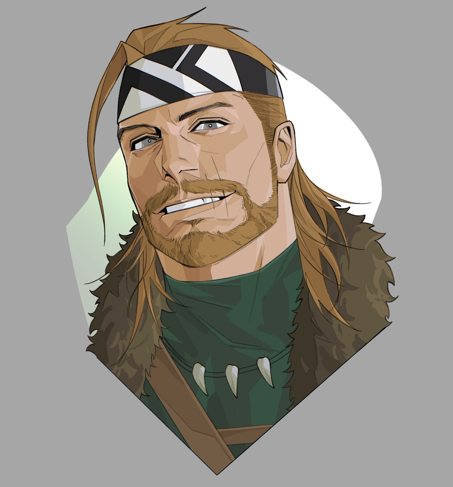
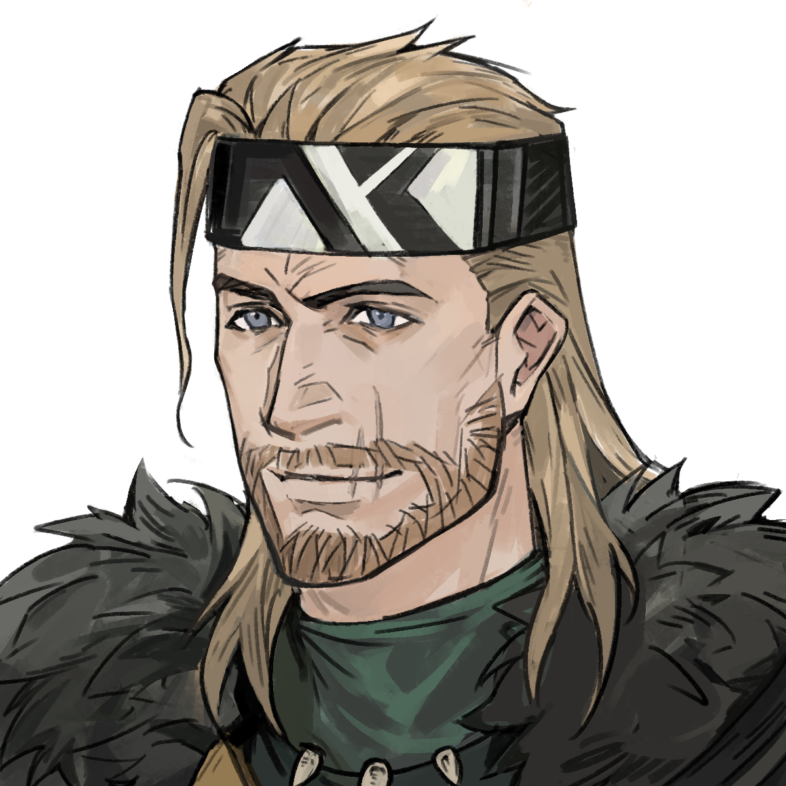
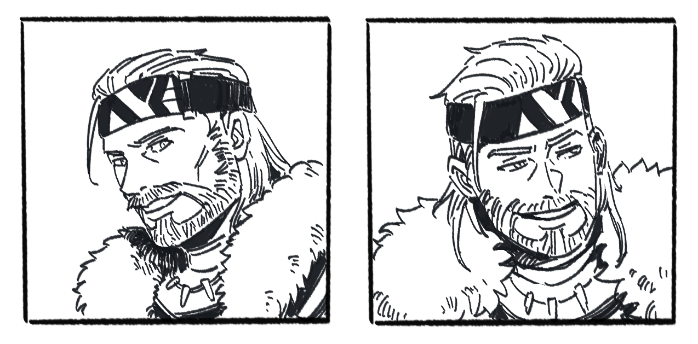

[← 返回目录](../README.md)

# 艾登与瑞秋

## 艾登·奥布莱恩（Aidan O'Brian）

  

诺德兰小有名气的典范级（Paragon）[冒险者](../世界/文明/帝国/职业/冒险者.md)。[北境](../世界/文明/帝国/北境.md)人（蛮族出身），[德鲁伊](../世界/信仰/自然信仰与德鲁伊.md)。当世极少数拥有完整德鲁伊传承的人类，同期学习者仅四人，他是唯一成为见习德鲁伊的。

装备：橡木杖（老师亲手制作的触媒，完成传承修行时的赠礼，刻有代表平静与治愈的符文）、牙龙皮革背包、银色金属片护额、绿色防风披肩。

德鲁伊能力：具备变形为动物的能力；入夜以冥想恢复魔力时，会与附近的动物和植物产生联系，共享感知，以维持与自然的纽带——远离自然的德鲁伊将逐渐失去力量。

蛮族出身，对很多社会礼节不太在意。年事已高（鬓角已白），计划带瑞秋南下交接人脉后退休，回[格莱德尼亚森林](../世界/信仰/自然信仰与德鲁伊.md)找老师（一位真·[精灵](../世界/种族/种族总览.md)大德鲁伊贤者）。当年因暗恋老师才去修行，直到毕业单相思。希望最后时光陪在她身边。

## 瑞秋（Rachel）

半精灵，外表少女实际快三十。寿命远超人类但不及纯血精灵。耳廓比常人略显修长。被艾登收养十八年，岁月染白了他的鬓角，却没在她身上留下任何痕迹。

自被收养以来一直以战士标准训练。使用细剑，速度极快，擅长在黑暗中匿行，进入备战状态后会与艾登保持若即若离的距离独立行动。幼年营养不良导致某些方面发育迟滞。以半精灵标准仍是孩子，但外表已与成年少女无异。

索伦特是帝国内少有的能直接买卖半精灵奴隶的边陲城塞，瑞秋的出身与此有关。

---

**相关条目**：[艾登与瑞秋线](../故事/故事线导读/艾登与瑞秋线.md) · [自然信仰与德鲁伊](../世界/信仰/自然信仰与德鲁伊.md) · [种族总览](../世界/种族/种族总览.md) · [巫妖灾害与北境独立](../世界/编年史/巫妖灾害与北境独立.md)
